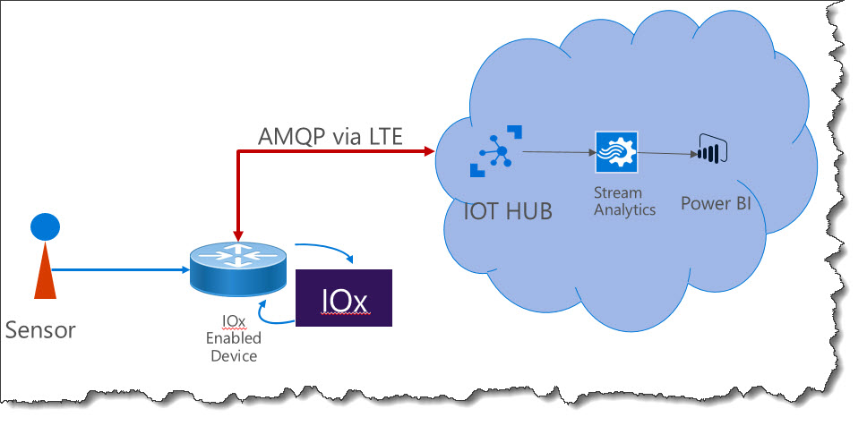

## IOXtoAzureIOT
#Cisco's IOX to Microsoft IOT Hub on Azure

This is only a "proof-of-concept" test. Therefore the coding is not fail-safe nor should the program parts run in production. It is done purely to show that we can combine the best of two worlds and we are able to send data back and forth.
First of all: This is the source where I get all my latest info from: [Cisco's Devnet for IOX] (https://developer.cisco.com/site/iox/), and of course my personal experience in several projects.

Overall Architecture:
 